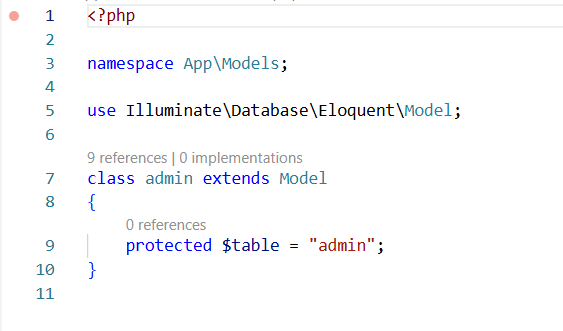

### 1.Giới thiệu dự án

Nhắc đến internet tại thời điểm này thì không còn quá xa lạ. Song có những lợi ích mà môi trường online này mang lại thì không phải ai cũng biết. Có thể nói, mạng internet là nơi mà con người có thể nói chuyện, trao đổi dữ liệu, đặc biệt có thể mua hàng trên mạng mà không cần phải tới trực tiếp cửa hàng, mà có được một món hàng mình ưng ý.

Shoe Shop là một ứng dụng web thương mại điện tử đơn giản áp dụng công nghệ thông tin vào hoạt động buôn bán giày qua mạng và sau này sẽ có xu hướng mở rộng.Và là một cửa hàng chuyên nhập giày từ các công ty phân phối nổi tiếng như Adidas, Nike, Converse, Biti’s,… để cho người tiêu dùng. Việc giao dịch với khách hàng chủ yếu diễn ra trên website.

Dự án Shoe Shop được xây dựng trên nền tảng Laravel, một framework PHP hiện đại và mạnh mẽ, sử dụng PHP 8.3.21 làm ngôn ngữ backend chính. Ứng dụng quản lý dữ liệu qua MySQL để thao tác cơ sở dữ liệu hiệu quả. Giao diện người dùng được phát triển với Blade Template và Bootstrap giúp đảm bảo tính responsive và thân thiện. Các công cụ như Composer hỗ trợ quản lý thư viện. Ngoài ra, Laravel Mix được dùng để quản lý tài sản frontend, mang lại trải nghiệm mượt mà cho người dùng.

### 2. Sinh viên thực hiện

Họ và tên: Phạm Gia Huy

Mã số sinh viên: 22010043

Lớp: K16-CNTT3

### 3. Sơ đồ cấu trúc (Class Diagram)

### 3. Sơ đồ thuật toán (Activity Diagram)

- Sơ đồ của trang web

### 4. Sơ đồ các chức năng 

Sơ đồ các chức năng :

- Sơ đồ chức năng đăng nhập người dùng

  

- Sơ đồ chức năng đăng nhập admin

- Sơ đồ chức năng danh sách sản phẩm

  

- Sơ đồ chức năng thêm sản phẩm

- Sơ đồ chức năng sửa sản phẩm 

- Sơ đồ chức năng xem sản phẩm 

  

- Sơ đồ chức năng xóa sản phẩm 

  

- Sơ đồ chức năng đặt đơn hàng 

### 5. Giao diện trang web

- Giao diện đăng nhập 

- Giao diện trang admin

- Giao diện trang chủ 

- Giao diện trang sản phẩm 

- Giao diện giỏ hàng 

- Giao diện liên hệ

### 6. Code minh họa phần chính của project

6.1.Code Model/Controller và view của người dùng

- Code Model

- Code Controller

- Code View

6.2. Code Model/Controller và View của sản phẩm

- Code Model

- Code Controller

- Code View

 

6.3. Code Model/Controller và View của đơn đặt hàng

- Code Model

- Code Controller

- Code View

6.4. Code Model/Controller của quản trị viên

- Code Model

- Code Controller

### 7. Link repository
https://github.com/pghuy1510/Shoe-shop.git

### 8. Link deploy
http://43.208.78.31/home
